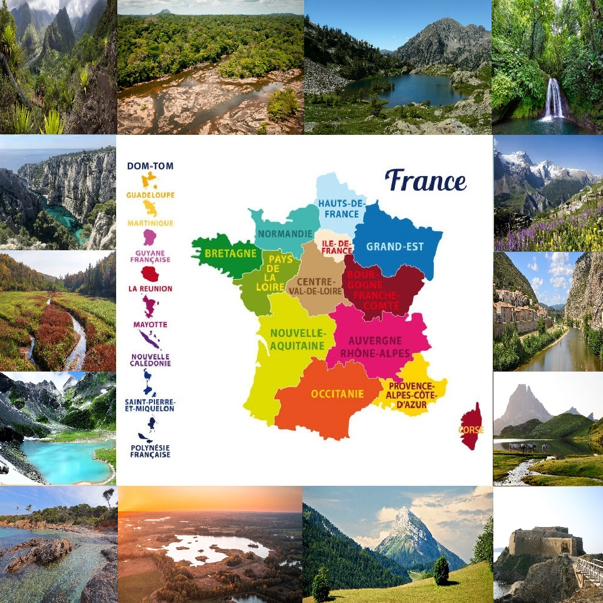

<div align ="center">
<h1 align="center">🌷 Welcome to Code Nature 🏞️ </h1>
<p align="center">
  
</p>
<p>
  
  <a href="https://github.com/team3/team3#readme" target="_blank">
    
  </a>
  <a href="https://github.com/team3/team3/graphs/commit-activity" target="_blank">
    
  </a>
  <a href="#" target="_blank">
    
  </a>
</p>

> Bienvenue dans Code Nature, un projet dédié à la découverte des parcs nationaux de France et de leur flore unique. Ce document offre un aperçu des 14 parcs nationaux et met en lumière certaines des fleurs emblématiques que vous pouvez y trouver.

### Que trouver :

<h1>🌿 Aperçu des Fleurs et des Parcs Nationaux de France</h1>

  

### Page du site :

[code-nature.netlify.app](https://code-nature.netlify.app/)

# 💻 Tech Stack:


  

## Install

```sh
npm install
```

## Team en charge du 👤

<br>Ce Hackathon a été réalisé par l'équipe suivante :</br>

<p>Hippolyte Weber</p>
<p>Pierre Juppin</p>
<p>Jebri Mohamed</p>
<p>Zainouddine Riday</p>
<p>Hamid Bouaïcha</p>
<p>Aurélien Chetot</p>


<p align="center">
  <a href="https://github.com/HippolyteWeber">Hippolyte Weber</a><br>
  <a href="https://github.com/Pierrejuppin">Pierre Juppin</a><br>
  <a href="https://github.com/memedjjebri">Mohamed Jebri</a><br>
  <a href="https://github.com/RiZainou/">Zainouddine Riday</a><br>
  <a href="https://github.com/hba0007">Hamid Bouaicha</a><br>
  <a href="https://github.com/AurelienChetot">Aurélien Chetot</a>
</p>


<p align="center">
  <a href="https://www.linkedin.com/in/hippolyteweber/">Hippolyte Weber</a><br>
  <a href="https://www.linkedin.com/in/pierre-juppin/">Pierre Juppin</a><br>
  <a href="https://www.linkedin.com/in/mohamed-jebri-3a11047b/">Mohamed Jebri</a><br>
  <a href="https://www.linkedin.com/in/zainou-riday/">Zainouddine Riday</a><br>
  <a href="https://www.linkedin.com/in/hamid-bouaicha-8568892bb/">Hamid Bouaicha</a><br>
  <a href="https://www.linkedin.com/in/aur%C3%A9lien-chetot-6861852b2/">Aurélien Chetot</a>
</p>

N'hésitez pas à nous contacter via LinkedIn pour toute question ou commentaire sur ce projet.
_This README was generated with ❤️ by [readme-md-generator](https://github.com/kefranabg/readme-md-generator)_
